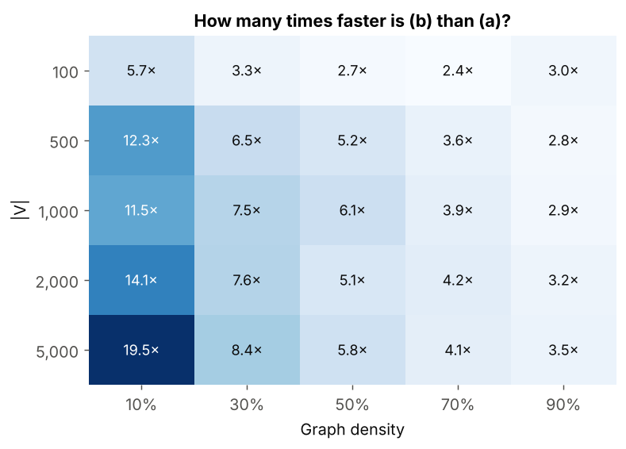
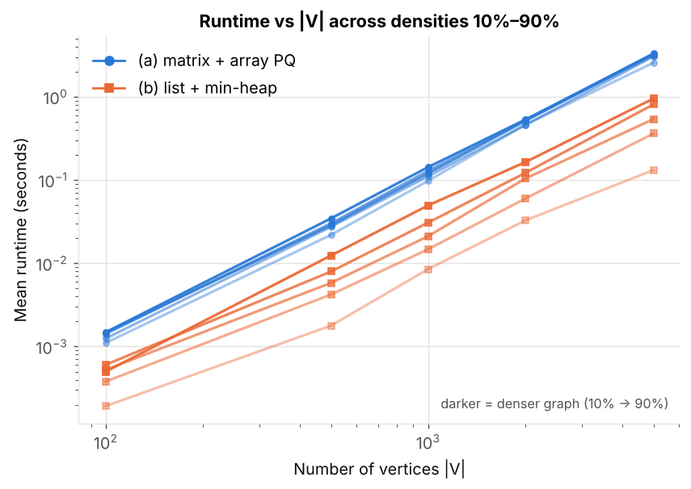
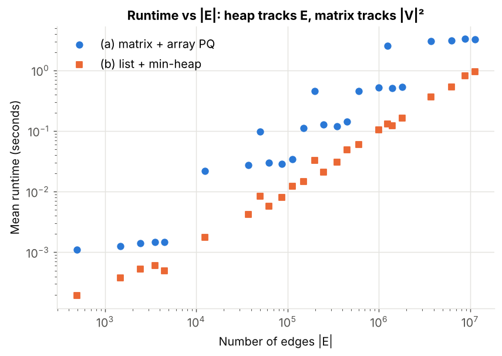
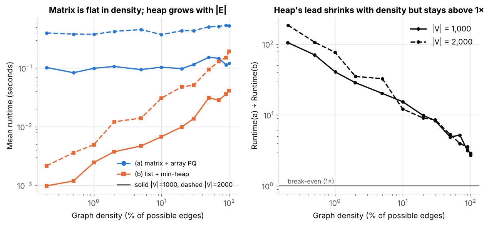
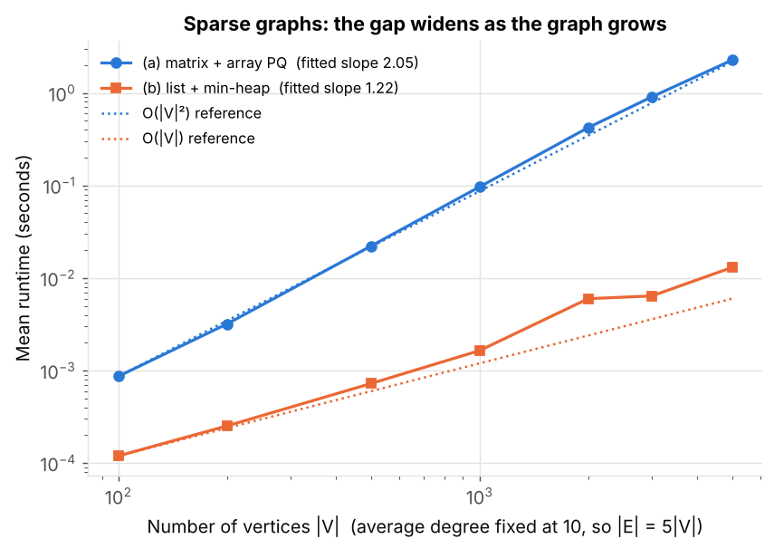
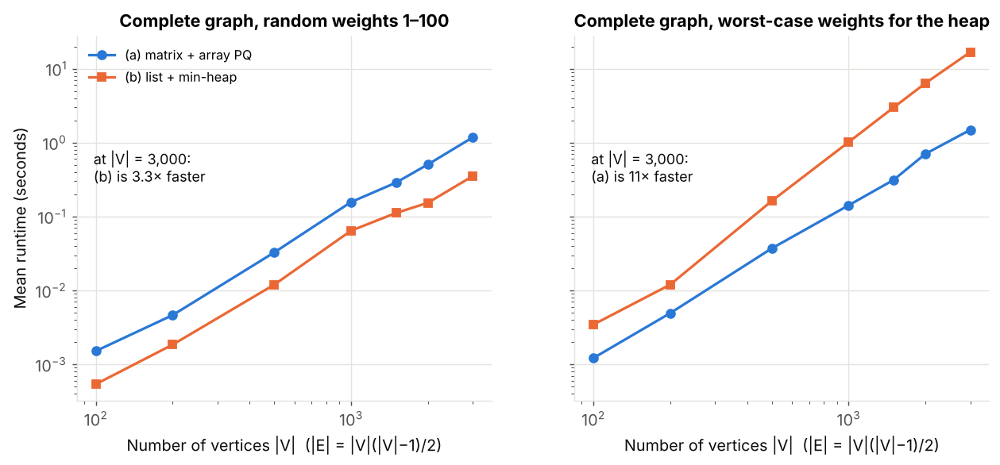
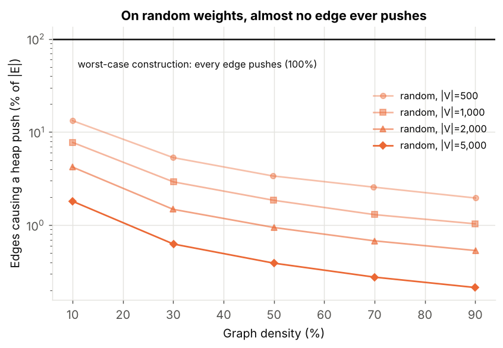

# Part (c): Comparing the two Dijkstra implementations

|  | Graph storage | Priority queue | Theory |
|---|---|---|---|
| **(a)** `part_a/dijkstra_matrix.py` | adjacency matrix | unsorted array (linear scan for the minimum) | Θ(\|V\|²), independent of \|E\| |
| **(b)** `part_b/dijkstra_heap.py` | array of adjacency lists | binary min-heap (`heapq`, lazy deletion) | O((\|V\|+\|E\|) log \|V\|) |

This folder compares them head to head. Parts (a) and (b) are **imported unmodified**; nothing in `part_a/` or `part_b/` is copied or changed.

## Files

| File | Purpose |
|---|---|
| `compare_common.py` | Graph generation (reuses Part (a)'s generator), matrix → list conversion, timing, operation counting, validation |
| `run_comparison.py` | The experiments (`grid`, `density`, `sparse`, `adversarial`, `complete`, `all`) |
| `plot_comparison.py` | Builds every chart and `results/fitted_exponents.md` from the CSVs |
| `results/*.csv` | Raw measurements (one CSV per experiment) |
| `results/compare_*.png` | Charts used in the slides |
| `results/summary_tables.md` | Full result tables (all experiments) |

Reproduce everything (takes about 10 minutes):

```bash
python part_c/run_comparison.py all
python part_c/plot_comparison.py
```

## Method (matches the team's agreed set-up)

Python, undirected, connected, weighted graphs, edge weights 1–100, source vertex 0, `time.perf_counter()`, |V| ∈ {100, 500, 1000, 2000, 5000}, density ∈ {10%, 30%, 50%, 70%, 90%}.

Fairness and correctness checks built into every run:

* **One graph, two representations.** Each graph is generated once (Part (a)'s generator, same per-configuration seed rule as parts (a)/(b): `42 + V + int(density*100)`), then converted to the adjacency list. For |V| ≤ 500 the converted list is also checked to be identical to what Part (b)'s own generator produces.
* **Distances must agree.** A row is only recorded if (a) and (b) return identical distances **and** both equal SciPy's compiled Dijkstra. Any mismatch aborts the run. All 70 graphs passed.
* **Same timing for both.** Mean of 3 runs per implementation per graph; the garbage collector is paused inside the timed region for both (a spot check with it on vs off changed times by only about 0.9–1.3×, in both directions).
* **Operation counts** (heap pushes, pops, edge scans) are recorded alongside the times, to explain *why* the times look the way they do.

## Results

### 1. Standard grid: (b) is faster everywhere, by a margin that depends on density



* (b) is **2.4× to 19.5×** faster than (a) on all 25 standard configurations.
* The gap is biggest on **sparse** graphs and large |V| (19.5× at |V| = 5000, 10% density) and smallest on **dense** graphs (about 3× at 90%).
* Full table: `results/summary_tables.md`.



The matrix curves for all five densities lie nearly on top of each other: (a)'s time depends on |V| and almost not at all on |E|. The heap curves spread out by density: (b)'s time depends on |E|.



### 2. Density sweep: the gap shrinks steadily but never closes (random weights)



At |V| = 1000, going from a bare spanning tree (0.2% density) to a complete graph (100%), (a) stays flat at about 0.1 s while (b) grows from about 1 ms to about 42 ms. The advantage of (b) falls from **105×** to **2.9×**, but it does not reach 1× even on the complete graph.

### 3. Sparse graphs (|E| = 5|V|): the gap grows with graph size



Fitted log-log slopes (runtime ∝ \|V\|^slope):

| Setting | (a) matrix slope | (b) heap slope |
|---|---|---|
| density 10%, \|V\| 500→5000 | 2.08 | 1.86 |
| density 50%, \|V\| 500→5000 | 2.02 | 1.99 |
| density 90%, \|V\| 500→5000 | 1.97 | 1.87 |
| sparse, \|E\|=5\|V\|, \|V\| 500→5000 | 2.02 | 1.27 |

(a) scales as |V|² in every setting. (b) scales close to linearly when |E| grows only linearly with |V|, and approaches |V|² on dense graphs, where |E| itself grows as |V|². The advantage of (b) on sparse graphs grows from 7× at |V| = 100 to **174× at |V| = 5000**.

### 4. Where (a) wins: a dense graph that forces a heap push on every edge



With ordinary random weights even a *complete* graph favours (b) by 2.4–3.3×, because very few edges ever improve a distance:



On the standard grid with |V| ≥ 500 only **0.2%–13%** of edges trigger a heap push (up to 37% at |V| = 100), and that fraction falls as the graph gets bigger or denser. So the heap's log factor is paid on very few operations.

To show that the theory's worst case is real, `build_adversarial_complete` builds a complete graph with weights `w(i,j) = 2j − 1 − 2i` (i < j). Dijkstra then settles vertices 0, 1, 2, … and settling vertex *i* improves **every** later vertex, so every edge causes a push (pushes ÷ \|E\| = 1.000 in all runs). Here (a) is **faster than (b) at every size, and by 11× at \|V\| = 3000** (1.5 s vs 16.8 s), the reverse of the standard results.
These weights go up to about 2|V| (outside the 1–100 range), so this is a deliberate worst-case construction reported separately, not part of the standard grid.

## Analysis: theory vs measurement

**(a) matrix + array.** The main loop runs |V| times; each iteration scans |V| entries to find the minimum and |V| matrix entries to relax. That is exactly 2|V|² basic steps whatever |E| is, so Θ(|V|²) always. Measured: slope ≈ 2.0 in every setting, and flat in density.

**(b) list + min-heap.** Each adjacency entry is scanned once (2|E| in total) and each successful relaxation does a heap push/pop costing O(log |V|). With lazy deletion at most 2|E| pushes occur, so the heap holds O(|E|) entries and log |E| = O(log |V|), giving O((|V|+|E|) log |V|):

* Sparse (|E| = O(|V|)): O(|V| log |V|), far below |V|². Measured slope 1.27, 174× faster at |V| = 5000.
* Dense (|E| = Θ(|V|²)): the worst case becomes O(|V|² log |V|), **worse than (a)**. Measured on the worst-case graph: (a) is 11× faster.
* In between, the break-even point in the worst case is around |E| ≈ |V|² / log |V|.

**Why (b) still wins on dense random graphs.** The O(|E| log |V|) bound is only reached when almost every edge causes a push. With random weights only a small fraction does, so the real cost is dominated by the 2|E| plain scans, i.e. about Θ(|E|). At 100% density 2|E| ≈ |V|², half of (a)'s 2|V|² steps, which predicts roughly a 2× advantage from step counts alone. Measured 2.4–3.3×. The remaining difference is Python constant factors.

## When is each implementation better?

**Prefer (b), adjacency list + min-heap, when:**

* the graph is **sparse** (|E| ≪ |V|²), which covers most real graphs (road networks, social/communication networks) and is where the gain is largest (up to 174× here), and the gap keeps growing with |V|;
* the graph is large: it also stores only Θ(|V|+|E|) data against Θ(|V|²) for the matrix;
* weights are not adversarial: on random weights it won at every density we tried, including complete graphs.

**Prefer (a), adjacency matrix + array, when:**

* the graph is genuinely **dense** *and* many edges improve distances (here 11× faster in the worst case), or you need the guaranteed Θ(|V|²) bound with no log factor and no dependence on weights;
* |V| is small (tens of vertices), where the absolute difference is microseconds and the simpler code and O(1) edge lookup are more attractive than the heap machinery.

**Rule of thumb:** use (b) unless the graph is dense *and* you cannot rule out heavy distance improvements; the best choice depends on edge count **and** on how often relaxations succeed, not on density alone.

## Caveats

* Timings come from one shared 2-core cloud machine; absolute seconds will differ on other machines, ratios are what to compare. Each point is the mean of 3 runs (standard deviations are in the CSVs).
* These are pure-Python implementations. In a compiled language the constant factors would differ and the dense-graph gap on random weights could shrink further, though the asymptotic picture is the same.
* Weights are random; the heap's real-world behaviour on dense graphs depends on how often relaxations succeed (see the worst-case graph).

## Why Part (c) re-runs both implementations instead of reusing the CSVs from parts (a) and (b)

The two existing CSVs have identical |V| and |E| in every row (so the graphs are the same), but they were evidently timed under different conditions, and dividing one by the other gives misleading ratios. Running Part (a)'s and Part (b)'s own experiment scripts unmodified on one machine gives different relative speeds to their saved CSVs. Taking the saved CSVs at face value, the median (a) ÷ (b) ratio on the standard grid would be about 1.7× and 4 of the 20 configurations would show the heap as *slower*; timed together on one machine the median is 4.6× and (b) wins all of them. The tables and charts in this folder therefore all come from a single same-machine run.
